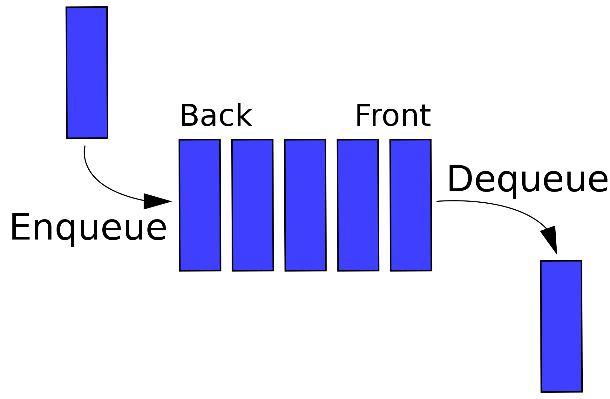

# QUEUE

### 개념

 출처 : 위키피디아

 

큐(queue)는 '대기줄' 라는 의미를 가지고 있으며, 말그대로 대기줄처럼 쌓은 형태의 자료구조이다.

쉽게 이해하려면 사람들이 런던베이글을 먹으려고 베이글 집에 줄을 선다고 가정해보자. 그 때 가장 먼저 줄을 선 사람부터 입장할 수 있다. 이렇게 가장 먼저 자료를 넣은 데이터가 먼저 나오는 **선입선출(FIFO - First In First Out)** 선형구조이다.

**큐에서의 자료 삽입은 큐의 끝(rear)에서만 진행되고, 삭제는 큐의 처음(front)에서만 삭제가 가능하다.**

 

### 연산
- queue.add(item) : 큐에 아이템 추가
- queue.offer(item) : 큐에 아이템 추가
- queue.peek() : 큐에 첫번째 자료 반환
- queue.poll() : 큐에 첫번째 자료 반환하고 큐 비어있을 경우 null
- queue.remove() : 큐에 첫번째 값 제거
- queue.clear() : 큐 초기화
- queue.size() : 큐 크기

 

### 활용예시
- 맛집 웨이팅을 줄 서서 기다릴 경우
- CPU와 주변기기 사이에 속도 차이로 인해 CPU 데이터를 큐에 저장할 경우

 

### 참고자료
https://ko.wikipedia.org/wiki/%ED%81%90_%28%EC%9E%90%EB%A3%8C_%EA%B5%AC%EC%A1%B0%29
 
https://piaflu.tistory.com/41
